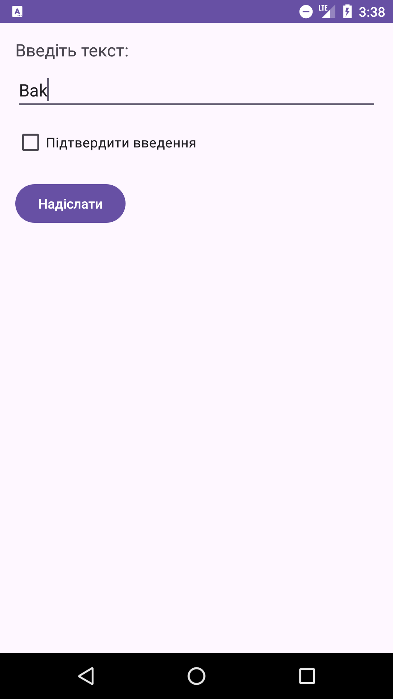
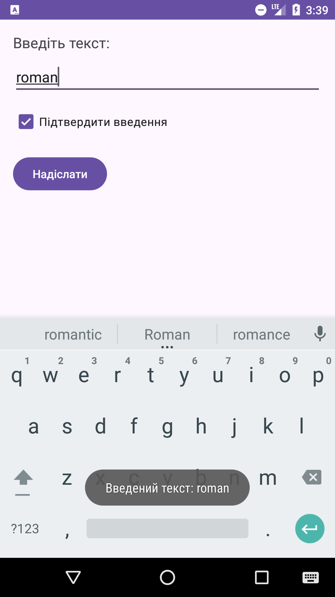
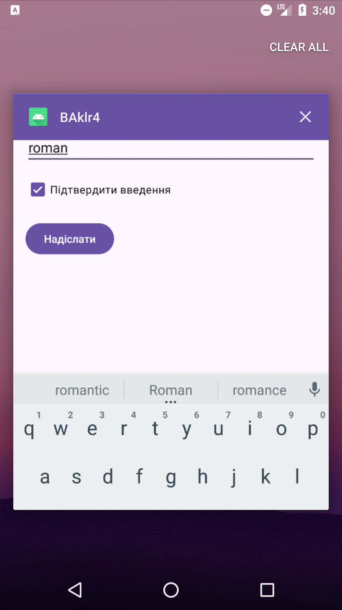

# Проект: Програма для введення тексту та підтвердження

Ця програма реалізує простий інтерфейс для введення тексту та підтвердження введення через `CheckBox`. Вона використовує стандартні елементи управління в Android, такі як `TextView`, `EditText`, `CheckBox`, і `Button`. Користувач може ввести текст, підтвердити введення через чекбокс і надіслати введений текст за допомогою кнопки.

## Вимоги
1. Програма повинна мати наступні елементи керування:
    - **CheckBox**
    - **TextView**
    - **EditText**
    - **Button**
2. Використання макета **LinearLayout** для розташування елементів управління.

## Функціональність
- **TextView**: виводить інструкцію для користувача — "Введіть текст".
- **EditText**: дозволяє користувачу ввести текст.
- **CheckBox**: дає можливість підтвердити введення.
- **Button**: надсилає введений текст, якщо `CheckBox` вибраний.

### Обробка подій:
- **CheckBox**: при виборі або скасуванні вибору, виводиться повідомлення через `Toast`.
- **Button**: перевіряє, чи вибрано `CheckBox`, і виводить введений текст або повідомлення про необхідність підтвердити введення.

## Структура проекту
Проект містить два основних файли:

### 1. `MainActivity.kt`
Це головна активність програми, яка реалізує логіку роботи з елементами інтерфейсу.

```kotlin
package com.example.bakroman

import android.os.Bundle
import android.widget.*
import androidx.appcompat.app.AppCompatActivity

class MainActivity : AppCompatActivity() {

    override fun onCreate(savedInstanceState: Bundle?) {
        super.onCreate(savedInstanceState)
        title = "Бак Роман" // Заголовок програми
        setContentView(R.layout.activity_main)

        // Отримуємо елементи за ID
        val textView: TextView = findViewById(R.id.textView)
        val editText: EditText = findViewById(R.id.editText)
        val checkBox: CheckBox = findViewById(R.id.checkBox)
        val button: Button = findViewById(R.id.button)

        // Обробник події для CheckBox
        checkBox.setOnCheckedChangeListener { _, isChecked ->
            if (isChecked) {
                Toast.makeText(this, "Ви підтвердили введення!", Toast.LENGTH_SHORT).show()
            }
        }

        // Обробник події для Button
        button.setOnClickListener {
            val inputText = editText.text.toString()
            if (checkBox.isChecked) {
                Toast.makeText(this, "Введений текст: $inputText", Toast.LENGTH_LONG).show()
            } else {
                Toast.makeText(this, "Підтвердьте введення перед відправкою!", Toast.LENGTH_LONG).show()
            }
        }
    }
}

```
## Скріншот 1, робота програми

## Скріншот 2, надсилання 

## Скріншот 3, назва програми
